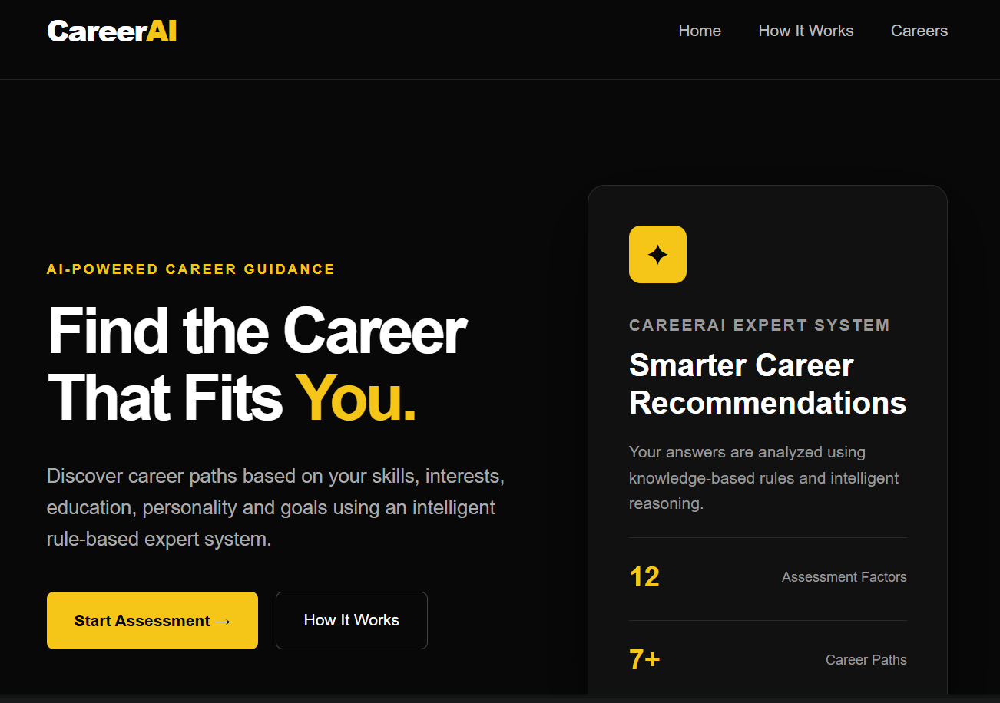
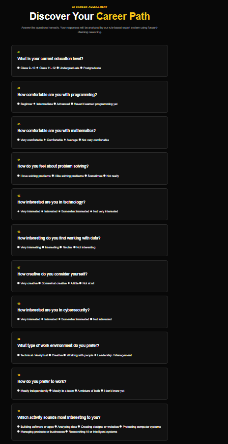

# CareerAI – AI Career Guidance Expert System

A rule-based AI career guidance expert system that analyzes a user's skills, interests, education level, work preferences, and career priorities to recommend suitable technology career paths.

The system uses a knowledge base of IF–THEN rules and a forward-chaining inference engine to derive additional profile facts before evaluating career-specific rules.

---

## Screenshots

### Home Page



### Career Assessment



### AI Career Analysis


---

## Features

- Interactive 12-question career assessment
- Rule-based expert system
- IF–THEN knowledge base
- Forward-chaining inference
- Multi-step fact derivation
- Weighted career matching
- Top 3 career recommendations
- Match percentage for each career
- Explanation of why a career matches the user
- AI inference trace showing how conclusions were derived
- Personalized learning roadmap
- Suggested skills and technologies
- Suggested projects for each career
- Responsive web interface
- Separate career information page
- Retake assessment functionality

---

## Technologies Used

### Backend

- Python
- Flask

### AI / Reasoning

- Rule-Based Reasoning
- Knowledge Representation
- IF–THEN Production Rules
- Forward Chaining
- Weighted Rule Matching
- Expert System Architecture

### Frontend

- HTML5
- CSS3
- Jinja2 Templates

---

## Careers Covered

The current knowledge base evaluates the following technology career paths:

- Software Engineer
- AI / ML Engineer
- Data Scientist
- Cybersecurity Analyst
- UI/UX Designer
- Web / App Developer
- Technology Product Manager

---

## How It Works

The system follows this pipeline:

```text
User
  ↓
Career Assessment
  ↓
User Answers
  ↓
User Facts
  ↓
Knowledge Base
  ↓
Forward-Chaining Inference Engine
  ↓
Derived Profile Facts
  ↓
Career Rules
  ↓
Weighted Matching
  ↓
Top Career Recommendations
  ↓
Learning Roadmap